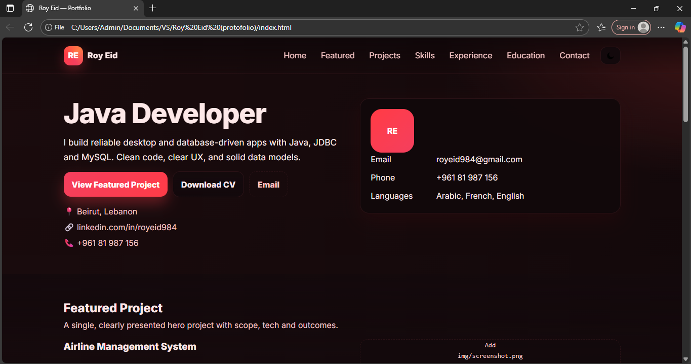
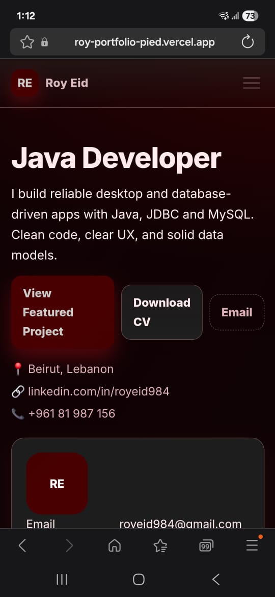

# Roy Eid — Portfolio

My personal portfolio website showcasing my skills, experience, and projects as a **Java Developer**.

## 🚀 Features
- Responsive layout with custom CSS.
- Dark/light theme toggle (saved in local storage).
- Hero section with quick links (CV download, email, LinkedIn).
- Dedicated sections: Featured Project, Projects, Skills, Experience, Education, Contact.
- Auto-updating footer year.

## 🛠️ Technologies Used
- **Frontend:** HTML5, CSS3, JavaScript (Vanilla JS).
- **Styling:** Custom CSS variables, Flexbox, CSS Grid.
- **Other tools:** Git, Netlify/Vercel (for deployment).

## 📂 Project Sections
- **Hero** → Name, title, CV download, contact links.
- **Featured Project** → Airline Management System (Java + MySQL).
- **Projects** → Inventory/POS prototype, Hotel Booking, Supermarket OOP.
- **Skills** → Tech, professional skills, tools.
- **Experience** → CCTV Operator role.
- **Education** → B.Sc. Computer Engineering, Sociology & Economy.
- **Contact** → Email, phone, LinkedIn.

## 📸 Screenshots
### Desktop

### Mobile

## 🔗 Live Demo
👉 [View Portfolio](https://roy-portfolio-pied.vercel.app)

## 📄 License
This project is licensed under the MIT License — see [LICENSE](./LICENSE).

---
💡 **Future Plans**
- Add backend (Node.js/Express).
- Contact form that sends email.
- Blog section with database.
- Admin dashboard.
